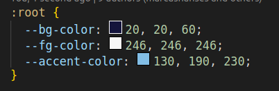

# CSS Variable Color Preview

This VSCode extension provides a **live color preview** for CSS variables that represent RGB values in your stylesheet. It automatically displays the preview of colors defined with comma-separated RGB values in your CSS files.

## Features

- **Color Preview for CSS Variables**: It detects and shows a color preview for CSS variables defined as RGB values (e.g., `--my-color: 255, 0, 0;`).
- **Real-time Updates**: The color preview is automatically updated as you modify the CSS variable's RGB values.
- **Intuitive & Simple**: The extension makes it easy to visualize your CSS colors directly in the editor without the need to open external tools or check the browser.
- 

## Supported Syntax

The extension supports CSS variables in the following format:

```css
--variable-name: r, g, b;
```



It will automatically show a color preview for each defined variable.

## Installation

1. Open Visual Studio Code.
1. Go to the Extensions Marketplace (Ctrl+Shift+X or Cmd+Shift+X on macOS).
1. Search for CSS Variable Color Preview.
1. Click Install to add the extension to your VSCode.

## Requirements

vscode 1.95.0 or greater.
